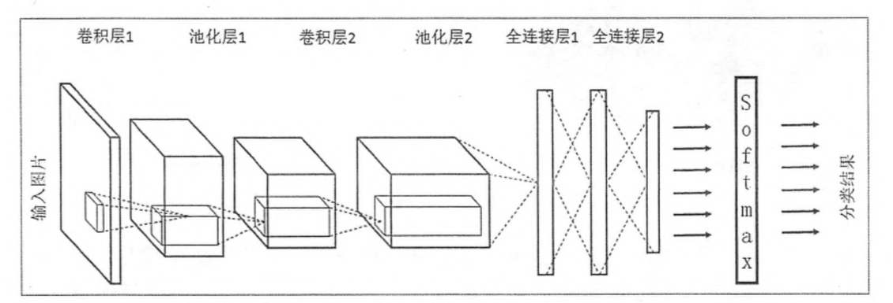
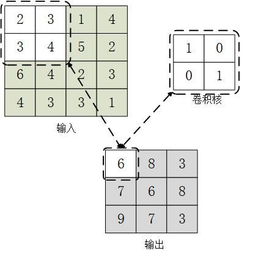
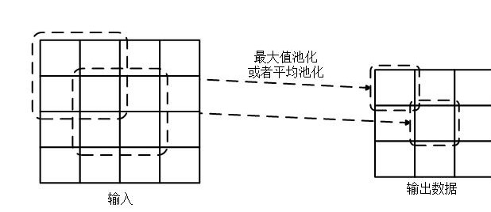
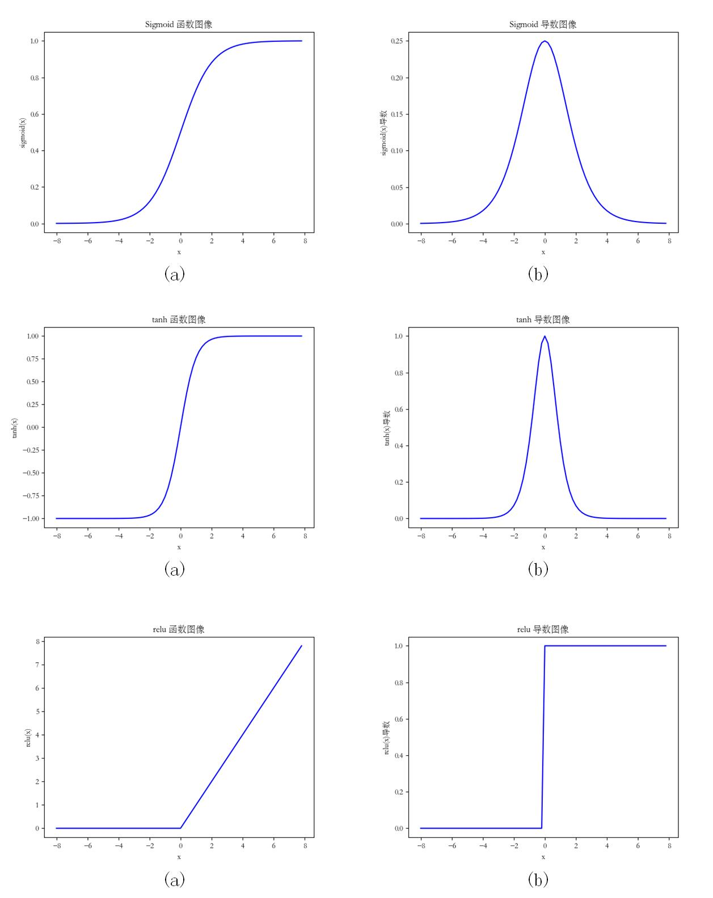
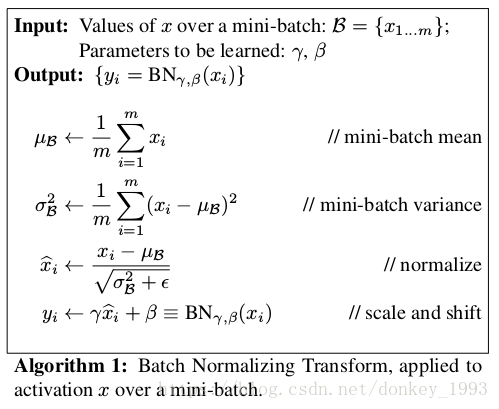

### CNN
#### 一、CNN结构
1. [卷积层](#p2)
2. [池化层](#p3)
3. [全连接层](#p4)
4. [其他](#p5)  
 [Dropout层](#p5.1)  
 [激活函数](#p5.2)  
 [BN 层](#p5.3)  
 [经典CNN](#p5.4)  

> CNN 结构如下所示  
> 

#### 二、卷积层
> 卷积层最主要的就是卷积运算，在图像识别中，卷积和图像滤波相类似。卷积核在图像上上下滑动，__图像像素值与卷积核相乘求和得到输出值__
> , 普通卷积过程如  
> 
> 
> 除了普通的卷积运算，还有其他形式的卷积运算，例如 __扩张卷积运算__ ，它除了受卷积核控制以外，还受另外一个参数d控制，d可以控制卷积核扩展多宽，控制卷积核的覆盖范围。 扩展卷积参考`https://www.cnblogs.com/zf-blog/p/12101300.html`

#### 三、池化层
> 池化层用于缩小数据规模，池化是一种非线性运算。池化计算受 __池化方法__、 __池化核大小__ 和 __滑动间隔__控制。
> 
> 常用的池化方法有 __最大池化__ 和 __平均池化__ 
> 
> 池化计算过程如
> 
> 

#### 四、全连接层
> 全连接层类似于人工神经网络，神经元之间是直接连接。它通常作为最终的分类层使用。与卷积层相比，他计算更快，但是其参数量很大。

#### 五、其他
##### Dropout层
> Dropout层是为了防止CNN发生过拟合，放置在全连接层，因为全连接层参数多，发生过拟合概率更大。
> 
> Dropout 基本方法是：每次在训练时按照一定的概率 p 丢失一部分神经元，让其不参与计算，降低训练时神经元之间的依赖性。这样训练会产生多个Dropout子模型，在最终使用模型时，所有的神经元都参与计算，相当于集合了所有的Dropout子模型，有助于提高模型的泛化能力。

##### 激活函数
> 激活函数主要对数据进行非线性处理，现在常用的激活函数有 __sigmoid、relu、tanh__
> 
> 其图像如下
> 
> 

##### BN 层
> BN(Batch Normalization) 是一种归一化层。CNN在训练时，每一次迭代产生的数据的分布不同，这就导致CNN在每一次迭代都需要适应新的分布，模型收敛速度变慢。
> 
> BN 层通过将每次输入的数据分布大小固定，提高模型收敛速度。
> 
> BN 层一般时放在 卷积层或者全连接层之后，归一化之后再使用激活函数进行非线性变换，BN 实现方法如下 
> 
> 
> 
> <small><i>参考论文：Batch Normalization: Accelerating Deep Network Training by Reducing Internal Covariate Shift</i></small>

##### 经典CNN
> 1. AlexNet
> 2. VGG
> 3. GoogleNet
> 4. ResNet
> 5. Inception-ResNet
